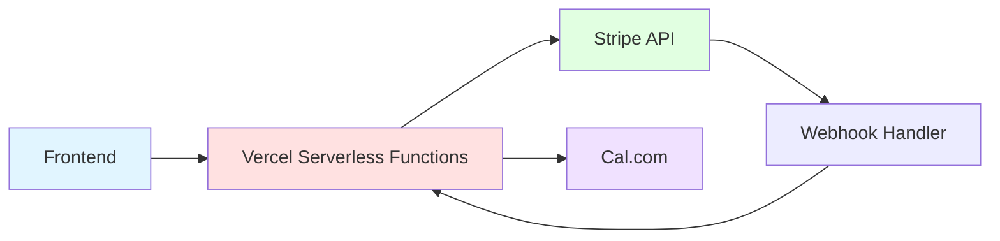

# VA Claim Readiness Diagnostic - API Integration Documentation

## Overview

This document details all external API integrations, serverless functions, environment variables, and webhook configurations for the VA Claim Readiness Diagnostic tool.

## Architecture Overview



## Serverless Functions

All API endpoints are deployed as Vercel serverless functions in the `/api` directory.

### Function Configuration (vercel.json)

```json
{
  "functions": {
    "api/**/*.js": {
      "memory": 1024,
      "maxDuration": 10
    }
  }
}
```

---

## 1. Diagnostic Logging Endpoint

### Endpoint: `/api/log-diagnostic.js`

**Purpose:** Log completed diagnostic data for analytics

**Method:** `POST`

**Request Headers:**
```
Content-Type: application/json
```

**Request Body:**
```javascript
{
  "timestamp": "2024-01-15T10:32:30.000Z",
  "answers": {
    "service_connection": 1,      // 0, 1, or 2
    "denial_handling": 0,
    "pathway": 1,
    "severity": 1,
    "secondaries": 0
  },
  "score": 3,                     // 0-10
  "recommendation": "REVIEW_BENEFICIAL"  // Category string
}
```

**Response (Success):**
```javascript
{
  "success": true,
  "id": "diag_1234567890_abc123",
  "note": "Data logged to console. Configure persistent storage for production."
}
```

**Response (Error):**
```javascript
{
  "error": "Invalid payload: Missing timestamp"
}
```

**Status Codes:**
- `200` - Success
- `400` - Invalid payload
- `405` - Method not allowed
- `500` - Internal server error

**Validation Rules:**
1. All fields required
2. Score must be number between 0-10
3. Each answer must be number between 0-2
4. All 5 questions must have answers
5. Timestamp must be valid ISO 8601 string

**Current Implementation:**
- Logs to console only (no persistent storage)
- Generates unique ID for each diagnostic
- Validates payload structure
- Returns success even if logging fails (non-blocking)

**Production Recommendations:**
- Add database integration (PostgreSQL, Supabase)
- Add Redis for caching
- Add error tracking (Sentry)
- Add analytics integration (Google Analytics, Mixpanel)

**Example Usage:**
```javascript
const logger = new DataLogger();
await logger.logDiagnostic({
  answers: diagnosticData.answers,
  score: diagnosticData.score,
  recommendation: diagnosticData.recommendation.category
});
```

---

## 2. Stripe Checkout Session Creation

### Endpoint: `/api/create-checkout-session.js`

**Purpose:** Create a Stripe Checkout session for payment

**Method:** `POST`

**Request Headers:**
```
Content-Type: application/json
```

**Request Body:**
```javascript
{
  "email": "veteran@example.com",  // Optional
  "calendlyEventUri": "",          // Optional - Cal.com event URI
  "calendlyInviteeUri": ""         // Optional - Cal.com invitee URI
}
```

**Response (Success):**
```javascript
{
  "sessionId": "cs_test_a1b2c3d4e5f6g7h8i9j0",
  "url": "https://checkout.stripe.com/c/pay/cs_test_..."
}
```

**Response (Error):**
```javascript
{
  "error": "Invalid email format. Please provide a valid email address."
}
```

**Status Codes:**
- `200` - Success
- `400` - Invalid request (bad email format)
- `405` - Method not allowed
- `500` - Server configuration error or Stripe API error

**Environment Variables Required:**
```
STRIPE_SECRET_KEY=sk_live_...
STRIPE_PRICE_ID=price_...
DOMAIN=https://yourdomain.com
```

**Stripe Checkout Configuration:**
```javascript
{
  payment_method_types: ['card'],
  line_items: [{
    price: process.env.STRIPE_PRICE_ID,
    quantity: 1
  }],
  mode: 'payment',
  success_url: `${domain}/success.html?session_id={CHECKOUT_SESSION_ID}`,
  cancel_url: `${domain}/results.html`,
  customer_email: email,  // If provided
  metadata: {
    service: 'Claim Readiness Review',
    timestamp: '2024-01-15T10:35:00.000Z',
    calEventUri: calendlyEventUri || '',
    calInviteeUri: calendlyInviteeUri || ''
  }
}
```

**Email Validation:**
```javascript
function isValidEmail(email) {
  const emailRegex = /^[^\s@]+@[^\s@]+\.[^\s@]+$/;
  return emailRegex.test(email);
}
```

**Error Handling:**
- Validates environment variables on function start
- Validates email format if provided
- Logs detailed errors for debugging
- Returns generic error messages to users (security)

**Example Usage:**
```javascript
const stripeIntegration = new StripeIntegration();
await stripeIntegration.createCheckoutSession({
  email: "veteran@example.com"
});
// Redirects to Stripe Checkout
```

---

## 3. Stripe Webhook Handler

### Endpoint: `/api/webhook.js`

**Purpose:** Handle Stripe webhook events (payment confirmations, failures, refunds)

**Method:** `POST`

**Request Headers:**
```
stripe-signature: t=1234567890,v1=abc123...
Content-Type: application/json
```

**Request Body:** (Stripe event object)
```javascript
{
  "id": "evt_1234567890",
  "type": "checkout.session.completed",
  "data": {
    "object": {
      "id": "cs_test_...",
      "customer_email": "veteran@example.com",
      "amount_total": 22500,  // $225.00 in cents
      "payment_status": "paid",
      "metadata": {
        "service": "Claim Readiness Review",
        "timestamp": "2024-01-15T10:35:00.000Z",
        "calEventUri": "https://cal.com/...",
        "calInviteeUri": "https://cal.com/..."
      }
    }
  }
}
```

**Response:**
```javascript
{
  "received": true
}
```

**Status Codes:**
- `200` - Event received and processed
- `400` - Invalid signature or missing signature
- `500` - Webhook not configured

**Environment Variables Required:**
```
STRIPE_SECRET_KEY=sk_live_...
STRIPE_WEBHOOK_SECRET=whsec_...
```

**Supported Event Types:**

1. **`checkout.session.completed`** - Payment successful
   - Booking confirmed
   - Log booking details
   - Send confirmation email (TODO)
   - Update database (TODO)

2. **`checkout.session.expired`** - Session expired
   - Release reserved time slot (TODO)
   - Send follow-up email (TODO)

3. **`payment_intent.succeeded`** - Payment intent succeeded
   - Update payment status
   - Trigger fulfillment

4. **`payment_intent.payment_failed`** - Payment failed
   - Log failure
   - Notify admin
   - Cancel booking if created

5. **`charge.refunded`** - Refund processed
   - Cancel Cal.com booking (TODO)
   - Send refund confirmation (TODO)
   - Update records

**Idempotency:**
```javascript
// In-memory store for processed event IDs
const processedEvents = new Set();

function isEventProcessed(eventId) {
  return processedEvents.has(eventId);
}

function markEventProcessed(eventId) {
  processedEvents.add(eventId);
}
```

**Security:**
- Verifies webhook signature before processing
- Prevents replay attacks
- Logs all events with context
- Returns 200 even on processing errors (prevents retries)

**Logging:**
```javascript
console.log({
  timestamp: new Date().toISOString(),
  message: 'Payment successful - Booking confirmed',
  eventId: event.id,
  sessionId: session.id,
  customerEmail: session.customer_email,
  amountTotal: session.amount_total / 100,
  currency: session.currency,
  paymentStatus: session.payment_status,
  metadata: session.metadata
});
```

**Production TODOs:**
- Add database integration for booking records
- Add email service integration (Resend, Mailchimp)
- Add Cal.com API integration for booking management
- Add admin notifications
- Add customer notifications
- Add CRM integration

---

## Stripe Integration

### Stripe.js Client-Side

**Loading:**
```html
<script src="https://js.stripe.com/v3/" async></script>
```

**Initialization:**
```javascript
const stripe = Stripe('pk_live_51SVcFoGp9b54FZ4DnEJBUFWqKZ3lSP8QDxjLfhkX8fJyM4qJAR6aWfBWfDsjTBmwE3YDbE6kyUpWHLiH1XXz9jEt00YH4ZDUkq');
```

**Creating Checkout Session:**
```javascript
// 1. Call backend to create session
const response = await fetch('/api/create-checkout-session', {
  method: 'POST',
  headers: { 'Content-Type': 'application/json' },
  body: JSON.stringify({ email: 'veteran@example.com' })
});

const { sessionId, url } = await response.json();

// 2. Redirect to Stripe Checkout
window.location.href = url;
```

**Payment Flow:**
```
User clicks "Book Review"
    ↓
POST /api/create-checkout-session
    ↓
Receive session URL
    ↓
Redirect to Stripe Checkout
    ↓
User enters payment info
    ↓
Stripe processes payment
    ↓
Stripe sends webhook to /api/webhook
    ↓
Redirect to success.html
```

### Stripe Products & Prices

**Product:** Claim Readiness Review

**Price:** $225.00 USD (one-time payment)

**Price ID:** `price_...` (stored in environment variable)

**Setup in Stripe Dashboard:**
1. Create Product: "Claim Readiness Review"
2. Add Price: $225.00, one-time
3. Copy Price ID to environment variable
4. Configure webhook endpoint
5. Copy webhook secret to environment variable

---

## Cal.com Integration

### Overview

Cal.com is used for appointment booking. The integration is currently manual (user books separately), but can be automated.

### Current Implementation

**Manual Booking Flow:**
1. User completes payment on Stripe
2. User receives confirmation email
3. User clicks booking link in email
4. User selects time slot on Cal.com
5. Cal.com sends confirmation

### Automated Integration (Recommended)

**Embedded Booking:**
```html
<!-- Embed Cal.com booking widget -->
<div 
  data-cal-link="your-username/claim-readiness-review"
  data-cal-config='{"theme":"light"}'
></div>
<script src="https://cal.com/embed.js"></script>
```

**API Integration:**
```javascript
// Create booking via Cal.com API
POST https://api.cal.com/v1/bookings
Headers:
  Authorization: Bearer YOUR_API_KEY
  Content-Type: application/json

Body:
{
  "eventTypeId": 123456,
  "start": "2024-01-20T14:00:00Z",
  "responses": {
    "name": "John Doe",
    "email": "veteran@example.com",
    "notes": "Diagnostic score: 3 (Mostly Ready)"
  },
  "metadata": {
    "diagnosticScore": 3,
    "recommendation": "REVIEW_BENEFICIAL",
    "stripeSessionId": "cs_test_..."
  }
}
```

**Environment Variables:**
```
CAL_COM_API_KEY=cal_live_...
CAL_COM_EVENT_TYPE_ID=123456
```

---

## Environment Variables

### Required Variables

```bash
# Stripe Configuration
STRIPE_SECRET_KEY=sk_live_...              # Stripe secret key (server-side)
STRIPE_PUBLISHABLE_KEY=pk_live_...         # Stripe publishable key (client-side)
STRIPE_WEBHOOK_SECRET=whsec_...            # Webhook signing secret
STRIPE_PRICE_ID=price_...                  # Price ID for $225 product

# Domain Configuration
DOMAIN=https://yourdomain.com              # Your domain (for redirect URLs)

# Cal.com Configuration (Optional)
CAL_COM_API_KEY=cal_live_...               # Cal.com API key
CAL_COM_EVENT_TYPE_ID=123456               # Event type ID for bookings

# Node Environment
NODE_ENV=production                        # Environment (development/production)
```

### Setting Environment Variables

**Local Development (.env file):**
```bash
STRIPE_SECRET_KEY=sk_test_...
STRIPE_PUBLISHABLE_KEY=pk_test_...
STRIPE_WEBHOOK_SECRET=whsec_...
STRIPE_PRICE_ID=price_...
DOMAIN=http://localhost:3000
```

**Vercel Production:**
```bash
# Via Vercel CLI
vercel env add STRIPE_SECRET_KEY
vercel env add STRIPE_WEBHOOK_SECRET
vercel env add STRIPE_PRICE_ID
vercel env add DOMAIN

# Or via Vercel Dashboard
# Settings → Environment Variables → Add
```

---

## CORS Configuration

### API Endpoints

All API endpoints include CORS headers:

```javascript
res.setHeader('Access-Control-Allow-Origin', '*');
res.setHeader('Access-Control-Allow-Methods', 'POST, OPTIONS');
res.setHeader('Access-Control-Allow-Headers', 'Content-Type');
```

### Vercel Configuration (vercel.json)

```json
{
  "headers": [
    {
      "source": "/api/(.*)",
      "headers": [
        { "key": "Access-Control-Allow-Credentials", "value": "true" },
        { "key": "Access-Control-Allow-Origin", "value": "*" },
        { "key": "Access-Control-Allow-Methods", "value": "GET,OPTIONS,PATCH,DELETE,POST,PUT" },
        { "key": "Access-Control-Allow-Headers", "value": "X-CSRF-Token, X-Requested-With, Accept, Accept-Version, Content-Length, Content-MD5, Content-Type, Date, X-Api-Version" }
      ]
    }
  ]
}
```

---

## Error Handling

### Client-Side Error Handling

```javascript
try {
  const response = await fetch('/api/create-checkout-session', {
    method: 'POST',
    headers: { 'Content-Type': 'application/json' },
    body: JSON.stringify({ email: 'invalid-email' })
  });
  
  if (!response.ok) {
    const error = await response.json();
    throw new Error(error.error);
  }
  
  const data = await response.json();
  window.location.href = data.url;
  
} catch (error) {
  console.error('Payment error:', error);
  alert('Payment failed. Please try again.');
}
```

### Server-Side Error Handling

```javascript
try {
  const session = await stripe.checkout.sessions.create(config);
  res.status(200).json({ sessionId: session.id, url: session.url });
  
} catch (error) {
  console.error('Error creating checkout session:', {
    message: error.message,
    type: error.type,
    code: error.code
  });
  
  res.status(500).json({ 
    error: 'Unable to process payment. Please try again or contact support.' 
  });
}
```

---

## Testing

### Testing Stripe Integration

**Test Mode:**
```bash
STRIPE_SECRET_KEY=sk_test_...
STRIPE_PUBLISHABLE_KEY=pk_test_...
```

**Test Cards:**
```
Success: 4242 4242 4242 4242
Decline: 4000 0000 0000 0002
Requires Authentication: 4000 0025 0000 3155
```

**Testing Webhooks Locally:**
```bash
# Install Stripe CLI
brew install stripe/stripe-cli/stripe

# Login
stripe login

# Forward webhooks to local server
stripe listen --forward-to localhost:3000/api/webhook

# Trigger test events
stripe trigger checkout.session.completed
stripe trigger payment_intent.payment_failed
```

### Testing API Endpoints

**Using curl:**
```bash
# Test diagnostic logging
curl -X POST http://localhost:3000/api/log-diagnostic \
  -H "Content-Type: application/json" \
  -d '{
    "timestamp": "2024-01-15T10:32:30.000Z",
    "answers": {
      "service_connection": 1,
      "denial_handling": 0,
      "pathway": 1,
      "severity": 1,
      "secondaries": 0
    },
    "score": 3,
    "recommendation": "REVIEW_BENEFICIAL"
  }'

# Test checkout session creation
curl -X POST http://localhost:3000/api/create-checkout-session \
  -H "Content-Type: application/json" \
  -d '{"email": "test@example.com"}'
```

---

## Security Best Practices

1. **Never expose secret keys in client-side code**
2. **Always verify webhook signatures**
3. **Use environment variables for all sensitive data**
4. **Validate all user input**
5. **Log errors without exposing internal details**
6. **Use HTTPS in production**
7. **Implement rate limiting (TODO)**
8. **Add request authentication (TODO)**

---

## Monitoring & Logging

### Recommended Tools

- **Vercel Analytics** - Built-in performance monitoring
- **Stripe Dashboard** - Payment monitoring
- **Sentry** - Error tracking
- **LogRocket** - Session replay
- **Google Analytics** - User behavior tracking

### Key Metrics to Track

- API response times
- Error rates
- Payment success rates
- Webhook processing times
- Diagnostic completion rates

---

## Production Checklist

- [ ] Switch to live Stripe keys
- [ ] Configure webhook endpoint in Stripe Dashboard
- [ ] Set up production environment variables in Vercel
- [ ] Test payment flow end-to-end
- [ ] Configure Cal.com integration
- [ ] Set up error tracking (Sentry)
- [ ] Set up monitoring (Vercel Analytics)
- [ ] Test webhook handling
- [ ] Configure email service
- [ ] Set up database for persistent storage
- [ ] Add rate limiting
- [ ] Add request authentication
- [ ] Test on multiple devices/browsers
- [ ] Load testing
- [ ] Security audit

---

## Conclusion

The API integration is designed to be simple, secure, and scalable. All sensitive operations happen server-side through Vercel serverless functions. The Stripe integration handles payments securely without touching your server. The webhook system ensures reliable payment confirmation and booking management.
