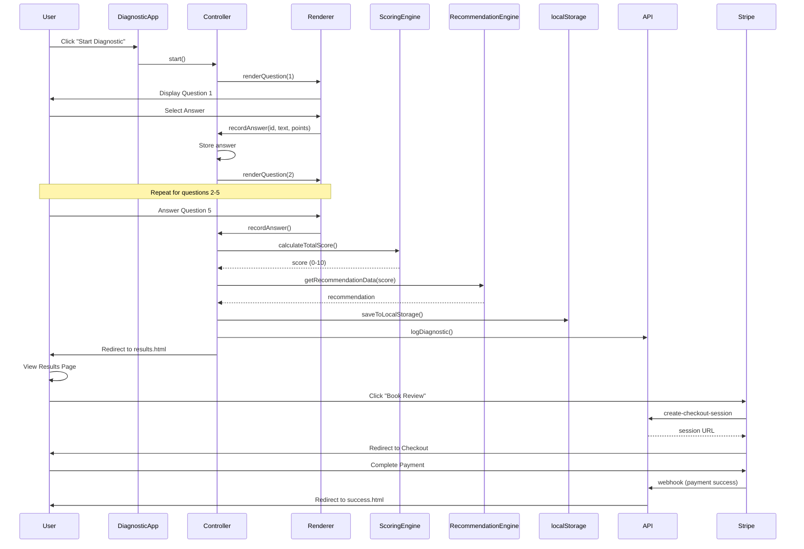
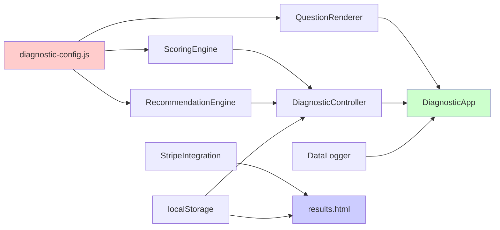

# VA Claim Readiness Diagnostic - Architecture Documentation

## Overview

The VA Claim Readiness Diagnostic is a lead generation tool built with vanilla JavaScript, designed to assess veterans' VA disability claim readiness through a 5-question diagnostic. The application uses a modular architecture with clear separation of concerns, making it maintainable and testable.

## Technology Stack

### Frontend
- **Vanilla JavaScript (ES6+)** - No frameworks, pure JS with class-based modules
- **HTML5** - Semantic markup with ARIA accessibility features
- **CSS3** - Custom properties, glassmorphism effects, responsive design
- **Lucide Icons** - SVG icon library

### Backend/Serverless
- **Vercel** - Hosting platform with serverless functions
- **Node.js** - Runtime for API endpoints
- **Stripe API** - Payment processing
- **Cal.com** - Appointment booking integration

### Testing
- **Jest** - Testing framework
- **jsdom** - DOM testing environment
- **fast-check** - Property-based testing library

## File Structure

```
project-root/
├── diagnostic.html              # Main diagnostic page (landing)
├── results.html                 # Results/booking page
├── success.html                 # Payment success page
├── diagnostic-config.js         # Configuration data (questions, recommendations)
├── diagnostic-main.js           # Main application orchestrator
│
├── Core Modules/
│   ├── DiagnosticController.js  # State management & orchestration
│   ├── ScoringEngine.js         # Score calculation logic
│   ├── RecommendationEngine.js  # Recommendation mapping
│   ├── QuestionRenderer.js      # UI rendering & DOM manipulation
│   ├── DataLogger.js            # Backend logging
│   └── StripeIntegration.js     # Payment processing
│
├── API Endpoints (Serverless)/
│   ├── api/create-checkout-session.js  # Stripe checkout creation
│   ├── api/webhook.js                  # Stripe webhook handler
│   └── api/log-diagnostic.js           # Diagnostic data logging
│
├── Tests/
│   ├── __tests__/DiagnosticController.test.js
│   ├── __tests__/ScoringEngine.test.js
│   ├── __tests__/RecommendationEngine.test.js
│   ├── __tests__/QuestionRenderer.test.js
│   ├── __tests__/DataLogger.test.js
│   ├── __tests__/StripeIntegration.test.js
│   ├── __tests__/diagnostic-integration.test.js
│   ├── __tests__/accessibility.test.js
│   ├── __tests__/responsive.test.js
│   ├── __tests__/animations.test.js
│   ├── __tests__/performance.test.js
│   └── __tests__/payment-integration.test.js
│
├── Configuration/
│   ├── jest.config.js           # Jest test configuration
│   ├── jest.setup.js            # Jest setup file
│   ├── vercel.json              # Vercel deployment config
│   ├── package.json             # Dependencies & scripts
│   └── .env                     # Environment variables
│
└── Documentation/
    ├── docs/ARCHITECTURE.md     # This file
    ├── docs/USER_FLOW.md
    ├── docs/API_INTEGRATION.md
    ├── docs/COMPONENT_REFERENCE.md
    ├── docs/STYLING_GUIDE.md
    └── docs/TESTING_DOCUMENTATION.md
```

## Architecture Diagram

```mermaid
graph TB
    subgraph "Frontend - diagnostic.html"
        A[User] --> B[DiagnosticApp]
        B --> C[DiagnosticController]
        B --> D[QuestionRenderer]
        
        C --> E[ScoringEngine]
        C --> F[RecommendationEngine]
        C --> G[DataLogger]
        
        D --> H[DOM Manipulation]
        D --> I[Event Handlers]
        D --> J[Animations]
    end
    
    subgraph "Data Storage"
        C --> K[localStorage]
        C --> L[sessionStorage]
    end
    
    subgraph "Backend - Vercel Serverless"
        G --> M[/api/log-diagnostic]
        N[StripeIntegration] --> O[/api/create-checkout-session]
        P[Stripe] --> Q[/api/webhook]
    end
    
    subgraph "External Services"
        O --> R[Stripe Checkout]
        R --> S[Cal.com Booking]
    end
    
    subgraph "Results Page - results.html"
        K --> T[Results Renderer]
        T --> N
    end
    
    style A fill:#e1f5ff
    style B fill:#fff4e1
    style C fill:#ffe1e1
    style D fill:#e1ffe1
    style E fill:#f0e1ff
    style F fill:#f0e1ff
    style G fill:#f0e1ff
```

## Data Flow Diagram



## Module Dependencies



## State Management

### State Flow

The application uses a finite state machine pattern managed by `DiagnosticController`:

```javascript
STATES = {
  INTRO: 'intro',
  QUESTION_1: 'question_1',
  QUESTION_2: 'question_2',
  QUESTION_3: 'question_3',
  QUESTION_4: 'question_4',
  QUESTION_5: 'question_5',
  RECOMMENDATION: 'recommendation'
}
```

### State Transitions

```
INTRO → QUESTION_1 → QUESTION_2 → QUESTION_3 → QUESTION_4 → QUESTION_5 → RECOMMENDATION → results.html
```

### Data Persistence

**localStorage** (persistent across sessions):
```javascript
{
  diagnostic_session: {
    sessionId: "diagnostic_1234567890_abc123",
    startTime: "2024-01-15T10:30:00.000Z",
    endTime: "2024-01-15T10:32:30.000Z",
    answers: {
      service_connection: { answerText: "Yes", points: 0, timestamp: "..." },
      denial_handling: { answerText: "Somewhat", points: 1, timestamp: "..." },
      // ... other answers
    },
    score: 3,
    recommendation: {
      category: "REVIEW_BENEFICIAL",
      message: "Your claim would BENEFIT from...",
      color: "#f59e0b",
      // ... other recommendation data
    }
  }
}
```

**sessionStorage** (cleared when browser closes):
```javascript
{
  diagnosticCompleted: "true",
  diagnosticRecommendation: "REVIEW_BENEFICIAL"
}
```

## Key Design Decisions

### 1. Vanilla JavaScript Over Frameworks

**Rationale:**
- Minimal bundle size (~50KB total vs 200KB+ for React)
- No build step required
- Faster initial load time
- Easier to understand and modify
- No framework lock-in

**Trade-offs:**
- Manual DOM manipulation
- More verbose event handling
- No virtual DOM optimizations

### 2. Modular Class-Based Architecture

**Rationale:**
- Clear separation of concerns
- Easy to test individual modules
- Reusable components
- Follows SOLID principles

**Benefits:**
- `ScoringEngine` can be tested independently
- `QuestionRenderer` handles all UI logic
- `DiagnosticController` orchestrates without knowing UI details

### 3. Serverless Functions for Backend

**Rationale:**
- Zero server management
- Auto-scaling
- Pay-per-use pricing
- Fast deployment

**Implementation:**
- Vercel serverless functions in `/api` directory
- Each endpoint is a separate file
- Automatic HTTPS and CDN distribution

### 4. localStorage for Data Persistence

**Rationale:**
- No backend database required for MVP
- Instant data access
- Works offline
- Simple implementation

**Limitations:**
- Data lost if user clears browser data
- No cross-device sync
- Limited to ~5-10MB storage

### 5. Immediate Redirect to Results Page

**Rationale:**
- Separates diagnostic flow from booking flow
- Allows users to review results before booking
- Enables sharing of results page URL
- Better conversion tracking

**Implementation:**
- After Q5, save to localStorage and redirect
- Results page reads from localStorage
- Dynamic content generation on results page

## Performance Optimizations

### 1. CSS Performance
- `transform: scaleX()` for progress bar (GPU-accelerated, no reflow)
- CSS custom properties for theming
- Preconnect hints for external resources

### 2. JavaScript Performance
- Lazy loading of Stripe.js with `async` attribute
- Event delegation where applicable
- Minimal DOM queries (cached selectors)
- Debounced animations

### 3. Loading Strategy
- Critical CSS inlined in `<head>`
- Scripts loaded at end of body
- Icons loaded from CDN with caching

## Security Considerations

### 1. Payment Security
- Stripe handles all card data (PCI compliant)
- No sensitive data touches your server
- Webhook signature verification

### 2. API Security
- Environment variables for API keys
- CORS headers configured
- Serverless functions isolated
- Input validation on all endpoints

### 3. Client-Side Security
- No sensitive data in localStorage
- Session data cleared appropriately
- Input validation on forms

## Scalability Considerations

### Current Limitations
- localStorage-only persistence (no database)
- In-memory webhook event tracking
- No user authentication
- Single language support

### Scaling Path
1. **Add Database** - PostgreSQL/Supabase for persistent storage
2. **Add Redis** - For webhook idempotency and caching
3. **Add Email Service** - Mailchimp/Resend for follow-ups
4. **Add Analytics** - Google Analytics/Plausible for tracking
5. **Add Admin Dashboard** - View diagnostic stats and manage bookings

## Deployment Architecture

```
User Request
    ↓
Vercel Edge Network (CDN)
    ↓
Static Files (HTML/CSS/JS) → Served from CDN
    ↓
API Requests → Vercel Serverless Functions
    ↓
External Services (Stripe, Cal.com)
```

### Vercel Configuration

**vercel.json:**
- Rewrites `/` to `/diagnostic.html`
- CORS headers for API routes
- Serverless function memory: 1024MB
- Max duration: 10 seconds

### Environment Variables Required

```
STRIPE_SECRET_KEY=sk_live_...
STRIPE_PUBLISHABLE_KEY=pk_live_...
STRIPE_WEBHOOK_SECRET=whsec_...
STRIPE_PRICE_ID=price_...
DOMAIN=https://yourdomain.com
```

## Error Handling Strategy

### Frontend Errors
- Graceful degradation for localStorage failures
- User-friendly error messages
- Console logging for debugging
- No blocking errors (user flow continues)

### Backend Errors
- Comprehensive error logging with context
- Generic error messages to users (no internal details)
- Webhook idempotency to prevent duplicates
- Retry logic for transient failures

## Accessibility Features

- WCAG 2.1 AA compliant
- ARIA labels and live regions
- Keyboard navigation support
- Screen reader announcements
- Reduced motion support
- Minimum 44x44px touch targets
- Color contrast ratios meet standards

## Browser Support

- Chrome 90+
- Firefox 88+
- Safari 14+
- Edge 90+
- Mobile browsers (iOS Safari 14+, Chrome Android 90+)

## Migration to React Considerations

When migrating to React, consider:

1. **State Management** - Use Context API or Redux instead of DiagnosticController
2. **Routing** - Use React Router for page transitions
3. **Components** - Convert each class to a React component
4. **Hooks** - Use useState, useEffect for state and side effects
5. **Styling** - Keep CSS-in-JS or use styled-components
6. **Testing** - Use React Testing Library instead of jsdom directly

## Conclusion

This architecture provides a solid foundation for a production-ready diagnostic tool. The modular design makes it easy to understand, test, and extend. The serverless backend keeps costs low while providing scalability. The vanilla JavaScript approach ensures fast load times and minimal complexity.
