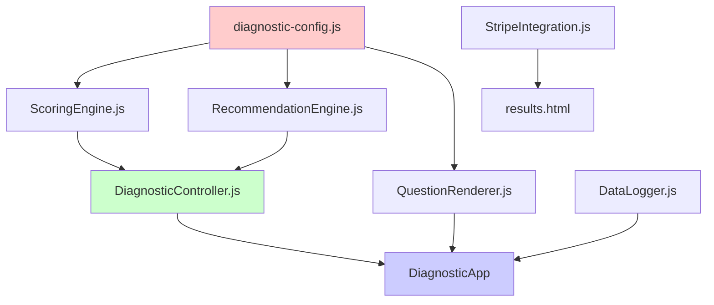

# VA Claim Readiness Diagnostic - Component Reference

## Overview

This document provides detailed documentation for each JavaScript module in the VA Claim Readiness Diagnostic tool. Each component is designed with single responsibility principle and clear interfaces.

## Module Dependency Graph



---

## 1. diagnostic-config.js

### Purpose
Central configuration file containing all questions, recommendations, and scoring rules. This is the single source of truth for diagnostic content.

### Exports

#### `QUESTIONS` Array
```javascript
[
  {
    id: 'service_connection',
    number: 1,
    title: 'Are you confident the VA can clearly see...',
    helper: 'A diagnosis alone isn\'t enough...',
    category: 'Service Connection',
    options: [
      { text: 'No — the connection is not clearly shown', points: 2 },
      { text: 'Somewhat — parts are there...', points: 1 },
      { text: 'Yes — the connection is clearly documented', points: 0 }
    ]
  },
  // ... 4 more questions
]
```

#### `RECOMMENDATION_CATEGORIES` Object
```javascript
{
  FULLY_READY: 'FULLY_READY',
  OPTIONAL_CONFIRMATION: 'OPTIONAL_CONFIRMATION',
  REVIEW_BENEFICIAL: 'REVIEW_BENEFICIAL',
  REVIEW_STRONGLY_RECOMMENDED: 'REVIEW_STRONGLY_RECOMMENDED'
}
```

#### `RECOMMENDATIONS` Object
```javascript
{
  FULLY_READY: {
    category: 'FULLY_READY',
    scoreRange: { min: 0, max: 0 },
    message: 'Your claim is FULLY READY...',
    color: '#10b981',
    icon: 'check-circle',
    ctaText: 'Book review for peace of mind',
    ctaOptional: true,
    tone: 'objective'
  },
  // ... 3 more categories
}
```

#### `ASSESSMENT_AREAS` Object
```javascript
{
  service_connection: 'Service connection clarity',
  denial_handling: 'Denial handling',
  pathway: 'Pathway selection',
  severity: 'Severity documentation',
  secondaries: 'Missing secondaries'
}
```

#### `STATUS_INDICATORS` Object
```javascript
{
  ADEQUATE: { icon: 'check-circle', label: 'Adequate', points: 0 },
  NEEDS_ATTENTION: { icon: 'alert-circle', label: 'Needs attention', points: 1 },
  MISSING: { icon: 'x-circle', label: 'Missing', points: 2 }
}
```

### Usage
```javascript
// Access questions
const firstQuestion = QUESTIONS[0];

// Access recommendation config
const recommendation = RECOMMENDATIONS[RECOMMENDATION_CATEGORIES.FULLY_READY];

// Access assessment area labels
const label = ASSESSMENT_AREAS['service_connection'];
```

### Modification Guide
To add a new question:
1. Add question object to `QUESTIONS` array
2. Add corresponding entry to `ASSESSMENT_AREAS`
3. Update total question count in UI (currently hardcoded as 5)

---

## 2. ScoringEngine.js

### Purpose
Handles all scoring logic for the diagnostic. Pure functions with no side effects.

### Class: `ScoringEngine`

#### Constructor
```javascript
constructor()
```
No initialization needed - all methods are stateless.

#### Methods

##### `getPointsForAnswer(questionId, answerText)`
Get point value for a specific answer.

**Parameters:**
- `questionId` (string) - Question identifier (e.g., 'service_connection')
- `answerText` (string) - Selected answer text

**Returns:** `number` - Point value (0, 1, or 2)

**Throws:** `Error` if question or answer not found

**Example:**
```javascript
const engine = new ScoringEngine();
const points = engine.getPointsForAnswer(
  'service_connection',
  'Somewhat — parts are there, but I\'m not fully sure'
);
// Returns: 1
```

##### `calculateTotalScore(answers)`
Calculate total score from all answers.

**Parameters:**
- `answers` (Object) - Map of question IDs to point values
  ```javascript
  {
    service_connection: 2,
    denial_handling: 1,
    pathway: 1,
    severity: 1,
    secondaries: 0
  }
  ```

**Returns:** `number` - Total score (sum of all points, 0-10)

**Example:**
```javascript
const score = engine.calculateTotalScore({
  service_connection: 1,
  denial_handling: 0,
  pathway: 1,
  severity: 1,
  secondaries: 0
});
// Returns: 3
```

##### `validateScore(score)`
Validate that a score is within valid range.

**Parameters:**
- `score` (number) - Score to validate

**Returns:** `boolean` - True if valid (0-10), false otherwise

**Example:**
```javascript
engine.validateScore(5);   // true
engine.validateScore(11);  // false
engine.validateScore(-1);  // false
```

### Dependencies
- `QUESTIONS` from diagnostic-config.js

### Testing
```javascript
// Unit tests in __tests__/ScoringEngine.test.js
describe('ScoringEngine', () => {
  test('calculates total score correctly', () => {
    const engine = new ScoringEngine();
    const score = engine.calculateTotalScore({
      service_connection: 2,
      denial_handling: 2,
      pathway: 2,
      severity: 2,
      secondaries: 2
    });
    expect(score).toBe(10);
  });
});
```

---

## 3. RecommendationEngine.js

### Purpose
Maps scores to recommendation categories and provides recommendation data.

### Class: `RecommendationEngine`

#### Constructor
```javascript
constructor()
```
No initialization needed - all methods are stateless.

#### Methods

##### `getRecommendation(score)`
Get recommendation category based on score.

**Parameters:**
- `score` (number) - Total diagnostic score (0-10)

**Returns:** `string` - Recommendation category

**Throws:** `Error` if score is invalid or no recommendation found

**Example:**
```javascript
const engine = new RecommendationEngine();
const category = engine.getRecommendation(3);
// Returns: 'REVIEW_BENEFICIAL'
```

**Score Mapping:**
- 0-0: `FULLY_READY`
- 1-2: `OPTIONAL_CONFIRMATION`
- 3-6: `REVIEW_BENEFICIAL`
- 7-10: `REVIEW_STRONGLY_RECOMMENDED`

##### `getRecommendationMessage(category)`
Get recommendation message text.

**Parameters:**
- `category` (string) - Recommendation category

**Returns:** `string` - Recommendation message

**Example:**
```javascript
const message = engine.getRecommendationMessage('REVIEW_BENEFICIAL');
// Returns: 'Your claim would BENEFIT from a Claim Readiness Review before filing'
```

##### `getRecommendationColor(category)`
Get recommendation color for styling.

**Parameters:**
- `category` (string) - Recommendation category

**Returns:** `string` - CSS color value

**Example:**
```javascript
const color = engine.getRecommendationColor('REVIEW_BENEFICIAL');
// Returns: '#f59e0b'
```

##### `getRecommendationIcon(category)`
Get recommendation icon identifier.

**Parameters:**
- `category` (string) - Recommendation category

**Returns:** `string` - Icon identifier (Lucide icon name)

**Example:**
```javascript
const icon = engine.getRecommendationIcon('REVIEW_BENEFICIAL');
// Returns: 'alert-triangle'
```

##### `getCTAText(category)`
Get CTA button text.

**Parameters:**
- `category` (string) - Recommendation category

**Returns:** `string` - CTA button text

##### `shouldShowCTA(category)`
Determine if CTA should be shown.

**Parameters:**
- `category` (string) - Recommendation category

**Returns:** `boolean` - Always true (CTA always shown)

##### `isCTAOptional(category)`
Check if CTA is optional.

**Parameters:**
- `category` (string) - Recommendation category

**Returns:** `boolean` - True if optional

##### `getRecommendationData(score)`
Get complete recommendation data object.

**Parameters:**
- `score` (number) - Total diagnostic score (0-10)

**Returns:** `Object` - Complete recommendation data
```javascript
{
  category: 'REVIEW_BENEFICIAL',
  score: 3,
  message: 'Your claim would BENEFIT from...',
  color: '#f59e0b',
  icon: 'alert-triangle',
  ctaText: 'Book Claim Readiness Review',
  ctaOptional: false,
  tone: 'objective',
  questionCategory: 'Claim Readiness'
}
```

**Example:**
```javascript
const data = engine.getRecommendationData(3);
console.log(data.message);  // 'Your claim would BENEFIT from...'
console.log(data.color);    // '#f59e0b'
```

### Dependencies
- `RECOMMENDATIONS` from diagnostic-config.js
- `RECOMMENDATION_CATEGORIES` from diagnostic-config.js

---

## 4. DiagnosticController.js

### Purpose
Central state management and orchestration for the diagnostic flow. Manages current state, stores answers, calculates scores, and coordinates between modules.

### Class: `DiagnosticController`

#### Constructor
```javascript
constructor()
```

**Initializes:**
- `currentState`: 'intro'
- `answers`: {}
- `score`: null
- `recommendation`: null
- `sessionId`: Generated unique ID
- `startTime`: ISO timestamp
- `scoringEngine`: New ScoringEngine instance
- `recommendationEngine`: New RecommendationEngine instance

#### Properties

- `currentState` (string) - Current state in the flow
- `answers` (Object) - Stored user answers
- `score` (number|null) - Calculated total score
- `recommendation` (Object|null) - Recommendation data
- `sessionId` (string) - Unique session identifier
- `startTime` (string) - ISO timestamp of session start

#### Methods

##### `generateSessionId()`
Generate a unique session ID.

**Returns:** `string` - Format: `diagnostic_<timestamp>_<random>`

**Example:**
```javascript
const id = controller.generateSessionId();
// Returns: 'diagnostic_1705320000_abc123def'
```

##### `getCurrentState()`
Get current state.

**Returns:** `string` - Current state

##### `setState(newState)`
Set new state.

**Parameters:**
- `newState` (string) - New state to transition to

**Throws:** `Error` if state is invalid

**Valid States:**
- `intro`
- `question_1` through `question_5`
- `recommendation`

##### `recordAnswer(questionId, answerValue, points)`
Record an answer for a question.

**Parameters:**
- `questionId` (string) - Question identifier
- `answerValue` (string) - Selected answer text
- `points` (number) - Points for this answer (0-2)

**Throws:** `Error` if inputs are invalid

**Stores:**
```javascript
{
  answerText: 'Somewhat — parts are there...',
  points: 1,
  timestamp: '2024-01-15T10:30:15.000Z'
}
```

**Example:**
```javascript
controller.recordAnswer(
  'service_connection',
  'Somewhat — parts are there, but I\'m not fully sure',
  1
);
```

##### `getAnswers()`
Get all recorded answers.

**Returns:** `Object` - All answers

##### `calculateScore()`
Calculate total score using ScoringEngine.

**Returns:** `number` - Total score (0-10)

**Side Effects:** Sets `this.score`

##### `getScore()`
Get current score.

**Returns:** `number|null` - Current score or null if not calculated

##### `start()`
Start the diagnostic (transition from intro to Q1).

**Throws:** `Error` if not in INTRO state

##### `nextQuestion()`
Advance to next question or show recommendation.

**Throws:** `Error` if not in a question state

**Behavior:**
- If on Q1-Q4: Advances to next question
- If on Q5: Calls `showRecommendation()`

##### `showRecommendation()`
Calculate and display recommendation.

**Side Effects:**
- Calculates score if not already done
- Gets recommendation from RecommendationEngine
- Transitions to RECOMMENDATION state

##### `getRecommendation()`
Get current recommendation.

**Returns:** `Object|null` - Recommendation data or null

##### `saveToLocalStorage()`
Save diagnostic data to localStorage.

**Throws:** `Error` if localStorage unavailable or quota exceeded

**Saves:**
```javascript
{
  sessionId: 'diagnostic_...',
  startTime: '2024-01-15T10:30:00.000Z',
  endTime: '2024-01-15T10:32:30.000Z',
  answers: { /* all answers */ },
  score: 3,
  recommendation: { /* recommendation data */ }
}
```

##### `loadFromLocalStorage()`
Load diagnostic data from localStorage.

**Returns:** `Object|null` - Loaded session data or null

### State Machine

```
INTRO
  ↓ start()
QUESTION_1
  ↓ nextQuestion()
QUESTION_2
  ↓ nextQuestion()
QUESTION_3
  ↓ nextQuestion()
QUESTION_4
  ↓ nextQuestion()
QUESTION_5
  ↓ nextQuestion()
RECOMMENDATION
```

### Dependencies
- `ScoringEngine`
- `RecommendationEngine`
- `QUESTIONS` from diagnostic-config.js

### Example Usage
```javascript
const controller = new DiagnosticController();

// Start diagnostic
controller.start();  // State: QUESTION_1

// Record answer
controller.recordAnswer('service_connection', 'Yes', 0);

// Advance
controller.nextQuestion();  // State: QUESTION_2

// ... repeat for all questions

// After Q5
controller.nextQuestion();  // Calculates score, gets recommendation

// Save data
controller.saveToLocalStorage();
```

---

## 5. QuestionRenderer.js

### Purpose
Handles all UI rendering and DOM manipulation. Manages screen transitions, animations, and user interactions.

### Class: `QuestionRenderer`

#### Constructor
```javascript
constructor(containerElement)
```

**Parameters:**
- `containerElement` (HTMLElement) - Main container for diagnostic

**Throws:** `Error` if container element not provided

#### Properties

- `container` (HTMLElement) - Main container element
- `callbacks` (Object) - Registered callback functions
  - `onAnswerSelected`: Function called when answer selected
  - `onStartClicked`: Function called when start button clicked
  - `onBookingClicked`: Function called when booking button clicked

#### Methods

##### `renderIntro()`
Render the intro screen with trust notes.

**Side Effects:**
- Hides all screens
- Shows intro screen
- Sets up start button event listener

##### `renderQuestion(questionData, currentStep, totalSteps)`
Render a question screen with progress indicator.

**Parameters:**
- `questionData` (Object) - Question data from configuration
- `currentStep` (number) - Current question number (1-5)
- `totalSteps` (number) - Total number of questions (5)

**Throws:** `Error` if invalid parameters

**Side Effects:**
- Updates progress indicator text
- Updates progress bar (using `transform: scaleX`)
- Updates question title and helper text
- Renders answer options
- Updates ARIA attributes

**Example:**
```javascript
renderer.renderQuestion(QUESTIONS[0], 1, 5);
```

##### `renderAnswerOptions(questionData)`
Render answer option cards.

**Parameters:**
- `questionData` (Object) - Question data with options

**Side Effects:**
- Clears existing options
- Creates answer card elements
- Adds click and keyboard event listeners

##### `handleAnswerSelection(selectedCard, questionId, answerText, points)`
Handle answer selection.

**Parameters:**
- `selectedCard` (HTMLElement) - Selected answer card
- `questionId` (string) - Question identifier
- `answerText` (string) - Selected answer text
- `points` (number) - Points for this answer

**Side Effects:**
- Adds visual feedback animation
- Marks card as selected
- Calls `onAnswerSelected` callback

##### `renderRecommendation(recommendationData)`
Render recommendation screen.

**Parameters:**
- `recommendationData` (Object) - Recommendation data

**Side Effects:**
- Updates recommendation icon
- Updates recommendation message
- Updates CTA button
- Initializes Lucide icons

##### `renderTransparency(answersData)`
Render transparency layer showing assessment breakdown.

**Parameters:**
- `answersData` (Object) - Map of question IDs to answer data

**Side Effects:**
- Creates assessment area elements
- Assigns status indicators based on points
- Initializes Lucide icons

##### `onAnswerSelected(callback)`
Register callback for answer selection.

**Parameters:**
- `callback` (Function) - Function to call when answer selected

**Throws:** `Error` if callback is not a function

##### `onStartClicked(callback)`
Register callback for start button click.

**Parameters:**
- `callback` (Function) - Function to call when start clicked

##### `onBookingClicked(callback)`
Register callback for booking button click.

**Parameters:**
- `callback` (Function) - Function to call when booking clicked

##### `prefersReducedMotion()`
Check if user prefers reduced motion.

**Returns:** `boolean` - True if reduced motion preferred

##### `transitionOut(callback)`
Transition out current screen with animation.

**Parameters:**
- `callback` (Function) - Function to call when transition completes

**Animation Duration:** 400ms (or 0ms if reduced motion)

##### `transitionIn()`
Transition in new screen with animation.

**Animation Duration:** 400ms (or 0ms if reduced motion)

##### `addAnswerSelectionFeedback(answerCard)`
Add visual feedback animation for answer selection.

**Parameters:**
- `answerCard` (HTMLElement) - Answer card element

**Animation:** Pulse effect (300ms)

##### `hideAllScreens()`
Hide all screens.

**Side Effects:** Removes 'active' class from all `.screen` elements

### Dependencies
- `QUESTIONS` from diagnostic-config.js
- `ASSESSMENT_AREAS` from diagnostic-config.js
- `STATUS_INDICATORS` from diagnostic-config.js
- Lucide Icons library

### Example Usage
```javascript
const container = document.querySelector('.diagnostic-container');
const renderer = new QuestionRenderer(container);

// Register callbacks
renderer.onStartClicked(() => {
  console.log('Start clicked');
});

renderer.onAnswerSelected((questionId, answerText, points) => {
  console.log(`Answer: ${answerText} (${points} points)`);
});

// Render intro
renderer.renderIntro();

// Render question
renderer.renderQuestion(QUESTIONS[0], 1, 5);
```

---

## 6. DataLogger.js

### Purpose
Handles logging diagnostic data to backend for analytics.

### Class: `DataLogger`

#### Constructor
```javascript
constructor()
```

**Initializes:**
- `endpoint`: '/api/log-diagnostic'

#### Methods

##### `formatPayload(answers, score, recommendation)`
Format diagnostic data into payload for backend.

**Parameters:**
- `answers` (Object) - Answer data with points
- `score` (number) - Total diagnostic score
- `recommendation` (string) - Recommendation category

**Returns:** `Object` - Formatted payload
```javascript
{
  timestamp: '2024-01-15T10:32:30.000Z',
  answers: {
    service_connection: 1,
    denial_handling: 0,
    pathway: 1,
    severity: 1,
    secondaries: 0
  },
  score: 3,
  recommendation: 'REVIEW_BENEFICIAL'
}
```

##### `async logDiagnostic(diagnosticData)`
Log diagnostic data to backend.

**Parameters:**
- `diagnosticData` (Object) - Complete diagnostic data
  - `answers`: Answer data
  - `score`: Total score
  - `recommendation`: Recommendation category

**Returns:** `Promise<Object>` - Response from backend

**Error Handling:** Catches errors gracefully, doesn't block user experience

**Example:**
```javascript
const logger = new DataLogger();
const result = await logger.logDiagnostic({
  answers: controller.getAnswers(),
  score: controller.getScore(),
  recommendation: controller.getRecommendation().category
});
```

##### `handleLoggingError(error)`
Handle logging errors gracefully.

**Parameters:**
- `error` (Error) - The error that occurred

**Side Effects:** Logs to console for debugging

### Dependencies
- `/api/log-diagnostic` endpoint

---

## 7. StripeIntegration.js

### Purpose
Handles Stripe payment integration for booking.

### Class: `StripeIntegration`

#### Constructor
```javascript
constructor(options = {})
```

**Parameters:**
- `options` (Object) - Configuration options
  - `apiEndpoint` (string) - Checkout session API endpoint (default: '/api/create-checkout-session')

**Initializes:**
- `apiEndpoint`: API endpoint URL
- `isProcessing`: false (prevents duplicate submissions)

#### Methods

##### `async createCheckoutSession(bookingData = {})`
Create a checkout session and redirect to Stripe.

**Parameters:**
- `bookingData` (Object) - Booking information
  - `email` (string) - Customer email (optional)
  - `calendlyEventUri` (string) - Cal.com event URI (optional)
  - `calendlyInviteeUri` (string) - Cal.com invitee URI (optional)

**Returns:** `Promise<void>`

**Side Effects:**
- Sets `isProcessing` to true
- Redirects to Stripe Checkout on success
- Displays error modal on failure

**Example:**
```javascript
const stripe = new StripeIntegration();
await stripe.createCheckoutSession({
  email: 'veteran@example.com'
});
// Redirects to Stripe Checkout
```

##### `getUserFriendlyErrorMessage(error)`
Convert technical errors to user-friendly messages.

**Parameters:**
- `error` (Error) - The error object

**Returns:** `string` - User-friendly error message

**Error Types Handled:**
- Network errors
- Timeout errors
- Card/payment errors
- Validation errors
- Configuration errors
- Server errors

##### `displayError(message)`
Display error message to user.

**Parameters:**
- `message` (string) - Error message to display

**Side Effects:** Creates and displays error modal with retry/close buttons

##### `isStripeLoaded()`
Check if Stripe.js is loaded.

**Returns:** `boolean` - True if Stripe.js is loaded

##### `async waitForStripe(timeout = 5000)`
Wait for Stripe.js to load.

**Parameters:**
- `timeout` (number) - Maximum time to wait in milliseconds

**Returns:** `Promise<boolean>` - True if loaded, false if timeout

### Dependencies
- `/api/create-checkout-session` endpoint
- Stripe.js library

---

## 8. diagnostic-main.js

### Purpose
Main application orchestrator that wires together all components.

### Class: `DiagnosticApp`

#### Constructor
```javascript
constructor()
```

**Initializes:**
- `controller`: null
- `renderer`: null
- `logger`: null
- `initialized`: false

#### Methods

##### `async init()`
Initialize the diagnostic application.

**Side Effects:**
- Creates DiagnosticController instance
- Creates QuestionRenderer instance
- Creates DataLogger instance
- Wires up event handlers
- Renders initial state (intro screen)

**Throws:** `Error` if initialization fails

##### `wireUpEventHandlers()`
Wire up all event handlers.

**Side Effects:**
- Registers start button handler
- Registers answer selection handler
- Registers CTA button handler

##### `renderCurrentState()`
Render the current state of the diagnostic.

**Side Effects:**
- Reads current state from controller
- Renders appropriate screen
- Handles transitions with animations

##### `saveToLocalStorage()`
Save diagnostic data to localStorage.

**Side Effects:** Calls `controller.saveToLocalStorage()`

##### `async logDiagnosticData()`
Log diagnostic data to backend.

**Side Effects:** Calls `logger.logDiagnostic()`

##### `redirectToResults()`
Redirect to results page with diagnostic data.

**Side Effects:**
- Sets sessionStorage flags
- Redirects to `/results.html`

##### `showBookingConfirmation()`
Show booking confirmation message.

**Side Effects:** Displays confirmation modal

### Initialization

```javascript
function initializeDiagnostic() {
  const app = new DiagnosticApp();
  app.init().catch(error => {
    console.error('Failed to initialize diagnostic:', error);
  });
}

// Initialize when DOM is ready
if (document.readyState === 'loading') {
  document.addEventListener('DOMContentLoaded', initializeDiagnostic);
} else {
  initializeDiagnostic();
}
```

### Dependencies
- All other modules (DiagnosticController, QuestionRenderer, DataLogger, etc.)

---

## Module Communication Flow

```
User Action
    ↓
QuestionRenderer (captures event)
    ↓
DiagnosticApp (event handler)
    ↓
DiagnosticController (state management)
    ↓
ScoringEngine / RecommendationEngine (business logic)
    ↓
DiagnosticController (stores result)
    ↓
QuestionRenderer (updates UI)
```

---

## Testing Strategy

Each module has corresponding test files in `__tests__/`:

- `ScoringEngine.test.js` - Unit tests for scoring logic
- `RecommendationEngine.test.js` - Unit tests for recommendation mapping
- `DiagnosticController.test.js` - Unit tests for state management
- `QuestionRenderer.test.js` - DOM manipulation tests
- `DataLogger.test.js` - API integration tests
- `StripeIntegration.test.js` - Payment flow tests
- `diagnostic-integration.test.js` - End-to-end integration tests

---

## Conclusion

This modular architecture provides clear separation of concerns, making the codebase easy to understand, test, and maintain. Each module has a single responsibility and well-defined interfaces. The design follows SOLID principles and is ready for migration to React or other frameworks.
