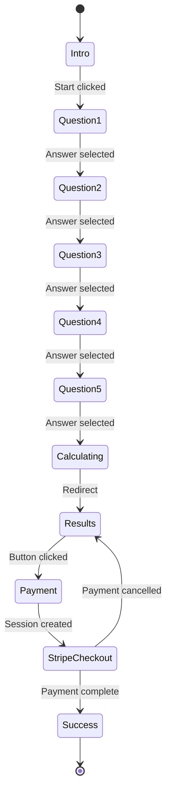

# VA Claim Readiness Diagnostic - User Flow Documentation

## Overview

This document describes the complete user journey through the VA Claim Readiness Diagnostic, from landing to payment completion.

## User Journey Map

```
Landing (diagnostic.html)
    ↓
Intro Screen
    ↓
Question 1 (Service Connection)
    ↓
Question 2 (Denial Handling)
    ↓
Question 3 (Claim Pathway)
    ↓
Question 4 (Medical Evidence)
    ↓
Question 5 (Secondary Conditions)
    ↓
[Score Calculation]
    ↓
Results Page (results.html)
    ↓
Payment (Stripe Checkout)
    ↓
Success Page (success.html)
```

## Detailed Flow

### 1. Landing / Intro Screen

**URL**: `/` or `/diagnostic.html`

**Screen Elements**:
- Title: "Before You File a VA Disability Claim, Know If It's Actually Ready"
- Subtitle: "Answer five quick questions to see if your VA claim is ready to file..."
- Trust indicators:
  - ⏱️ Takes ~2 minutes
  - 🔒 No email required
  - 🎓 Educational & veteran-first
  - 🏛️ Not affiliated with the VA
- CTA Button: "Start Diagnostic"

**User Actions**:
- Read information
- Click "Start Diagnostic" button

**System Actions**:
- Initialize DiagnosticController
- Initialize QuestionRenderer
- Set state to INTRO
- Wait for user interaction

**Transition**:
- Fade out intro screen (400ms animation)
- Fade in Question 1 screen (400ms animation)
- Update state to QUESTION_1

---

### 2. Question Screens (1-5)

Each question follows the same pattern with different content.

#### Question 1: Service Connection

**Screen Elements**:
- Progress indicator: "Question 1 of 5 • Service Connection"
- Progress bar: 20% filled (blue gradient)
- Question title: "Are you confident the VA can clearly see how your condition is connected to service?"
- Helper text: "A diagnosis alone isn't enough — the VA looks for specific medical or service evidence..."
- Answer options (3 cards):
  - "No — the connection is not clearly shown" (2 points)
  - "Somewhat — parts are there, but I'm not fully sure" (1 point)
  - "Yes — the connection is clearly documented" (0 points)

**User Actions**:
- Read question and helper text
- Click one of the three answer cards
- See visual feedback (card pulses and highlights)

**System Actions**:
1. Record answer with metadata:
   ```javascript
   {
     answerText: "Yes — the connection is clearly documented",
     points: 0,
     timestamp: "2024-01-15T10:30:00.000Z"
   }
   ```
2. Add visual feedback animation (300ms)
3. Wait 400ms for user to see selection
4. Transition to next question

**Transition**:
- Fade out current question (400ms)
- Update progress bar (smooth transform animation)
- Fade in next question (400ms)

#### Question 2: Denial Handling

**Progress**: 40% (Question 2 of 5)

**Question**: "If you were denied before, do you fully understand — and have you fixed — the actual reason for denial?"

**Helper**: "Many veterans later realize they were fixing the wrong issue because denial letters are easy to misunderstand."

**Answers**:
- "No — I'm not sure what the reason was" (2 points)
- "Somewhat — I think I understand but I'm not certain" (1 point)
- "Yes — I understand and have addressed it" (0 points)

#### Question 3: Claim Pathway

**Progress**: 60% (Question 3 of 5)

**Question**: "Are you certain you're filing under the correct claim type for your situation?"

**Helper**: "Filing a new, supplemental, or increase claim under the wrong path can delay or derail a claim."

**Answers**:
- "No — I'm not sure which type applies" (2 points)
- "Somewhat — I think I know but I'm not certain" (1 point)
- "Yes — I'm certain of the correct pathway" (0 points)

#### Question 4: Medical Evidence

**Progress**: 80% (Question 4 of 5)

**Question**: "Is your medical evidence detailed enough to support the rating level you're seeking?"

**Helper**: "The VA rates based on documented severity, frequency, and functional impact — not just a diagnosis."

**Answers**:
- "No — my evidence is minimal or vague" (2 points)
- "Somewhat — I have some details but could be more thorough" (1 point)
- "Yes — my evidence is detailed and comprehensive" (0 points)

#### Question 5: Secondary Conditions

**Progress**: 100% (Question 5 of 5)

**Question**: "Have you identified all conditions caused or worsened by your service-connected issues?"

**Helper**: "Secondary conditions are often missed and discovered only after a denial or low rating."

**Answers**:
- "No — I haven't considered secondary conditions" (2 points)
- "Somewhat — I've identified some but may have missed others" (1 point)
- "Yes — I've identified all related conditions" (0 points)

---

### 3. Score Calculation (Behind the Scenes)

**Happens After Question 5**:

After the user answers Question 5, the system:

1. **Calculates Total Score**:
   ```javascript
   score = sum of all answer points (0-10)
   ```

2. **Determines Recommendation Category**:
   - Score 0-2: "Strong" (Ready to file)
   - Score 3-6: "Mostly ready" (Some concerns)
   - Score 7-10: "High risk" (Not ready)

3. **Saves to localStorage**:
   ```javascript
   {
     sessionId: "diagnostic_1705318200000_abc123",
     startTime: "2024-01-15T10:30:00.000Z",
     endTime: "2024-01-15T10:32:15.000Z",
     answers: { /* all 5 answers */ },
     score: 3,
     recommendation: { /* recommendation data */ }
   }
   ```

4. **Logs to Backend**:
   - POST to `/api/log-diagnostic`
   - Includes answers, score, recommendation
   - Non-blocking (doesn't wait for response)

5. **Redirects to Results**:
   - Sets `sessionStorage.diagnosticCompleted = true`
   - Redirects to `/results.html`

**No Recommendation Screen Shown**: The user is immediately redirected to the results page instead of seeing a recommendation screen on the diagnostic page.

---

### 4. Results Page

**URL**: `/results.html`

**Data Source**: Reads from `localStorage.diagnostic_session`

**Screen Sections**:

#### A. Header
- Title: "Claim Readiness Check"
- Subtitle: "Identify common VA claim risks before filing."
- Divider line

#### B. Main Recommendation

**Dynamic Content Based on Score**:

**Score 0-2 (Strong)**:
- Main message: "Your claim appears READY to file"
- Subtitle: "Your answers suggest your claim is well-prepared and aligned with VA requirements."
- Badge: "Claim Strength: Strong" (green border, green text)

**Score 3-6 (Mostly Ready)**:
- Main message: "Your claim appears mostly ready — with a few areas worth reviewing"
- Subtitle: "This is common. Many veterans in this range file confidently but later discover small issues."
- Badge: "Claim Strength: Mostly ready" (orange border, orange text)

**Score 7-10 (High Risk)**:
- Main message: "Your answers suggest your claim may face avoidable denial risks"
- Subtitle: "Most veterans only uncover these issues after a denial — often months later."
- Badge: "Claim Strength: High risk" (red border, red text)

#### C. Two-Column Info Section

**Left Column: "Why This Recommendation Was Shown"** (Red/Pink background)

**Dynamic Content**: Shows only areas where user had issues (points > 0)

Example for score of 5 (issues in Q1, Q3, Q5):
- ❌ Service connection clarity - "Service connection is not clearly documented" (red border)
- ⚠️ Claim pathway selection - "Claim pathway needs confirmation" (yellow border)
- ❌ Secondary conditions - "Secondary conditions have not been considered" (red border)

**Special Case - Perfect Score (0)**:
- Background changes to green
- Title changes to "Your Claim Strengths"
- Shows all 5 areas with green checkmarks

**Right Column: "What a Claim Readiness Review Focuses On"** (Blue background)

**Static Content** (same for everyone):
- Service connection review
- Evidence alignment
- Denial risk identification
- Claim strategy clarity
- Independent & confidential

#### D. Booking Section

**What to Expect** (left):
- ⏱️ 60-Minute Consultation
- ✅ Expert Guidance
- 📄 Detailed Action Plan
- 🔒 Confidential & Secure

**What to Prepare** (right):
- 📁 Service Records
- ❤️ Medical Documentation
- ✅ Previous VA Decisions
- ❓ Your Questions

#### E. Payment Section

**Dynamic Button Text Based on Score**:

**Score 0-2**:
- Button: "Optional Final Readiness Review"
- Subtext: "Even strong claims benefit from a final double-check."

**Score 3-10**:
- Button: "Get an Honest Claim Readiness Review"
- Subtext: "No guarantees. No filing. Just clarity."

**Price**: $225

**Trust Badge**: "🔒 Secure payment powered by Stripe"

**User Actions**:
- Review their results
- Read about the service
- Click payment button

**System Actions**:
- Load diagnostic data from localStorage
- Calculate score dynamically
- Render personalized content
- Set up Stripe integration

---

### 5. Payment Flow

**Triggered By**: User clicks "Pay $225 & Schedule Appointment" button

**Step 1: Create Checkout Session**

```javascript
POST /api/create-checkout-session
Body: {
  email: "user@example.com" (optional),
  calendlyEventUri: "..." (if pre-booked),
  calendlyInviteeUri: "..." (if pre-booked)
}

Response: {
  sessionId: "cs_test_...",
  url: "https://checkout.stripe.com/c/pay/cs_test_..."
}
```

**Step 2: Redirect to Stripe**

User is redirected to Stripe Checkout page:
- Pre-filled email (if provided)
- Line item: "Claim Readiness Review - $225"
- Payment methods: Credit/debit cards
- Secure Stripe-hosted page

**Step 3: User Completes Payment**

User enters:
- Card number
- Expiration date
- CVC
- Billing address

**Step 4: Payment Processing**

Stripe processes payment and:
- **Success**: Redirects to `/success.html?session_id=cs_test_...`
- **Failure**: Shows error, allows retry
- **Cancel**: Redirects to `/results.html`

**Step 5: Webhook Notification**

Stripe sends webhook to `/api/webhook`:
```javascript
Event: checkout.session.completed
Data: {
  id: "cs_test_...",
  customer_email: "user@example.com",
  amount_total: 22500, // $225.00 in cents
  payment_status: "paid",
  metadata: {
    service: "Claim Readiness Review",
    calEventUri: "...",
    calInviteeUri: "..."
  }
}
```

System logs payment confirmation and booking details.

---

### 6. Success Page

**URL**: `/success.html?session_id=cs_test_...`

**Screen Elements**:
- ✅ Large checkmark icon
- Title: "Payment Successful!"
- Message: "Your Claim Readiness Review has been booked."
- Details:
  - Confirmation email sent
  - Calendar invite sent (if Cal.com integrated)
  - Next steps
- CTA: "Return to Home" or "View Booking Details"

**User Actions**:
- Read confirmation
- Check email for details
- Close page or navigate away

---

## Branching Logic

### Score-Based Branching

The application has three main paths based on total score:

```
Score 0-2 (Strong)
├── Badge: Green "Claim Strength: Strong"
├── Message: "Your claim appears READY to file"
├── Button: "Optional Final Readiness Review"
└── Tone: Positive, reassuring

Score 3-6 (Mostly Ready)
├── Badge: Orange "Claim Strength: Mostly ready"
├── Message: "Your claim appears mostly ready — with a few areas worth reviewing"
├── Button: "Get an Honest Claim Readiness Review"
└── Tone: Neutral, educational

Score 7-10 (High Risk)
├── Badge: Red "Claim Strength: High risk"
├── Message: "Your answers suggest your claim may face avoidable denial risks"
├── Button: "Get an Honest Claim Readiness Review"
└── Tone: Serious, urgent
```

### Answer-Based Content

The "Why This Recommendation Was Shown" section dynamically shows only problem areas:

```
For each question:
  If points = 0: ✅ Don't show (or show with green checkmark if score = 0)
  If points = 1: ⚠️ Show with yellow border and "needs attention" message
  If points = 2: ❌ Show with red border and "critical issue" message
```

---

## State Transitions



---

## Timing and Animations

### Screen Transitions
- Fade out: 400ms ease
- Fade in: 400ms ease
- Total transition: 800ms

### Answer Selection
- Pulse animation: 300ms
- Delay before next question: 400ms
- Total: 700ms

### Progress Bar
- Transform animation: 300ms ease
- Uses `transform: scaleX()` for performance

### Reduced Motion
- Users with `prefers-reduced-motion: reduce` get instant transitions (0ms)

---

## Error Handling

### Payment Errors

**Network Error**:
- Message: "Network error. Please check your connection and try again."
- Action: Show retry button

**Card Declined**:
- Message: "Payment declined. Please check your card details and try again."
- Action: Return to Stripe checkout

**Server Error**:
- Message: "Server error. Please try again in a few moments or contact support."
- Action: Show retry button

### Data Loading Errors

**No Diagnostic Data**:
- If user accesses results.html without completing diagnostic
- Shows empty results with warning
- Suggests completing diagnostic first

**localStorage Unavailable**:
- Graceful degradation
- Shows generic results
- Logs warning to console

---

## Analytics Events

Key events to track:

1. **Diagnostic Started**: User clicks "Start Diagnostic"
2. **Question Answered**: Each answer selection (with question ID and points)
3. **Diagnostic Completed**: User finishes Q5 (with total score)
4. **Results Viewed**: User lands on results.html (with score category)
5. **Payment Initiated**: User clicks payment button
6. **Payment Completed**: Successful payment (with amount)
7. **Payment Failed**: Failed payment (with error type)

---

## Mobile Considerations

### Touch Targets
- All buttons minimum 44x44px
- Answer cards have generous padding
- Progress bar visible but not interactive

### Responsive Breakpoints
- Mobile: ≤768px (single column, larger text)
- Tablet: 769-1024px (optimized spacing)
- Desktop: >1024px (full layout)

### Mobile-Specific Behaviors
- Trust notes stack vertically
- Two-column info section becomes single column
- Larger touch targets for answer cards
- Simplified animations on slower devices

---

## Accessibility Features

### Keyboard Navigation
- Tab through all interactive elements
- Enter/Space to select answers
- Focus indicators on all buttons

### Screen Readers
- ARIA labels on all interactive elements
- Progress bar has `role="progressbar"` with `aria-valuenow`
- Semantic HTML (h1, h2, nav, main, section)
- Alt text on icons

### Visual Accessibility
- High contrast colors (WCAG AA compliant)
- Large, readable fonts (16px base)
- Clear focus indicators
- No color-only information

---

## User Experience Principles

1. **Transparency**: Show exactly why recommendation was given
2. **No Pressure**: Optional CTA for strong scores
3. **Educational**: Helper text explains each question
4. **Fast**: ~2 minutes to complete
5. **Privacy**: No email required for diagnostic
6. **Trust**: Clear indicators (no VA affiliation, veteran-first)
7. **Honest**: Objective recommendations, no guarantees
