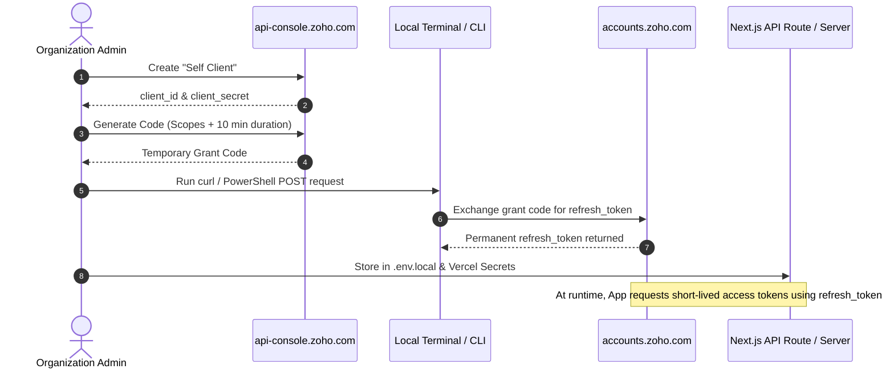

# Zoho CRM OAuth 2.0 Credentials Setup Guide

This guide details the step-by-step procedure for generating OAuth 2.0 client credentials and a permanent refresh token for Zoho CRM server-side lead automation in the Military Disability Nexus platform.

---

## Overview & Architecture

Lead submission automation communicates with Zoho CRM via OAuth 2.0 server-to-server calls. Because this integration runs within server-side API routes (`pages/api/*`) or backend services, it uses Zoho's **Self Client** model:
1. A temporary grant code (authorization code) is generated manually from the Zoho Developer Console.
2. The grant code is exchanged for a permanent **Refresh Token** via an API request.
3. The server application uses the `refresh_token`, `client_id`, and `client_secret` to dynamically generate short-lived access tokens (valid for 1 hour) without user interaction.



---

## Step-by-Step Setup Instructions

### Step 1: Open Zoho Developer Console
1. Ensure you are signed in under the organization's primary Zoho CRM account.
2. Navigate to: [https://api-console.zoho.com/](https://api-console.zoho.com/)

### Step 2: Create a Client
1. Click **Add Client** (or **Get Started** if this is the first client).
2. Choose **Self Client** as the Client Type:
   - *Why Self Client?* Self Client is designed specifically for standalone backend services and internal scripts that do not require an interactive OAuth redirect URI.
3. Click **Create** to confirm.
4. On the **Client Secret** tab, locate and securely note:
   - **Client ID** (`ZOHO_CLIENT_ID`)
   - **Client Secret** (`ZOHO_CLIENT_SECRET`)

### Step 3: Generate the Grant Code
1. Click on the **Generate Code** tab within your Self Client.
2. Fill in the code generation parameters:
   - **Scope:**
     ```text
     ZohoCRM.modules.leads.ALL,ZohoCRM.modules.custom.ALL,ZohoCRM.settings.ALL
     ```
     *(Required for creating, reading, and updating lead records as well as custom field and layout access.)*
   - **Time Duration:** Select **10 minutes** (the maximum allowable duration to exchange the temporary code).
   - **Scope Description:** `Website Lead Automation`
3. Click **Generate**.
4. In the pop-up modal, select the appropriate Zoho CRM portal/organization if prompted.
5. Copy the generated **Grant Code**.

> [!IMPORTANT]
> The grant code expires in 10 minutes and can only be used once. Proceed immediately to Step 4.

### Step 4: Generate the Permanent Refresh Token
Open your terminal (macOS/Linux bash or Windows PowerShell) and execute the exchange request.

#### Option A: Using cURL (Bash / macOS / Linux / Git Bash)
```bash
curl -X POST https://accounts.zoho.com/oauth/v2/token \
  -d "grant_type=authorization_code" \
  -d "client_id=YOUR_CLIENT_ID" \
  -d "client_secret=YOUR_CLIENT_SECRET" \
  -d "code=YOUR_GRANT_CODE"
```

#### Option B: Using PowerShell (Windows)
```powershell
Invoke-RestMethod -Method Post -Uri "https://accounts.zoho.com/oauth/v2/token" -Body @{
  grant_type    = "authorization_code"
  client_id     = "YOUR_CLIENT_ID"
  client_secret = "YOUR_CLIENT_SECRET"
  code          = "YOUR_GRANT_CODE"
}
```

#### Expected JSON Response
```json
{
  "access_token": "1000.xxxx...",
  "refresh_token": "1000.xxxx...",
  "api_domain": "https://www.zohoapis.com",
  "token_type": "Bearer",
  "expires_in": 3600
}
```

> [!NOTE]
> The `refresh_token` returned in this response does **not expire** unless explicitly revoked in the Zoho Developer Console. Save this `refresh_token` securely.

---

## Step 5: Configure Environment Variables

Add the credentials to your environment files and deployment targets.

### Local Development (`frontend/.env.local`)
Create or edit `frontend/.env.local` and add:
```env
# Zoho CRM Configuration (Server-side Lead automation)
ZOHO_CLIENT_ID=1000.xxxxxxxxxxxxxxxxxxxxxxxxxxxxxx
ZOHO_CLIENT_SECRET=xxxxxxxxxxxxxxxxxxxxxxxxxxxxxxxxxxxxxxxxxx
ZOHO_REFRESH_TOKEN=1000.xxxxxxxxxxxxxxxxxxxxxxxxxxxxxx
ZOHO_ACCOUNTS_URL=https://accounts.zoho.com
ZOHO_API_DOMAIN=https://www.zohoapis.com
```

### Production & Preview Deployment (Vercel)
In the Vercel Dashboard:
1. Go to **Project Settings** → **Environment Variables**.
2. Add the following variables for **Production** and **Preview** environments:
   - `ZOHO_CLIENT_ID`
   - `ZOHO_CLIENT_SECRET`
   - `ZOHO_REFRESH_TOKEN`
   - `ZOHO_ACCOUNTS_URL` (default: `https://accounts.zoho.com`)
   - `ZOHO_API_DOMAIN` (default: `https://www.zohoapis.com`)
3. Ensure values are saved without surrounding quotes or accidental whitespace.

---

## Step 6: Testing & Verification Runbook

### 1. Local CLI Diagnostic Verification
Run the automated diagnostic tool from the `frontend/` directory to verify credentials without triggering web forms:

```bash
cd frontend
node scripts/testZohoConnection.js
```
*(Or from the repository root: `node frontend/scripts/testZohoConnection.js`)*

**What this verifies:**
1. **Environment Detection:** Confirms `ZOHO_CLIENT_ID`, `ZOHO_CLIENT_SECRET`, and `ZOHO_REFRESH_TOKEN` are loaded from `.env.local` or environment variables without crashing when unconfigured.
2. **Token Acquisition:** Executes `getAccessToken(forceRefresh = true)` against the Zoho OAuth servers and outputs a masked confirmation token (`Token acquired: **********`).
3. **End-to-End Upsert:** Transmits a clearly marked test record (`zoho-test-verification@militarydisabilitynexus.com`) to the Zoho CRM Leads API.
4. **CRM Confirmation:** Displays the returned Zoho Record ID and action (`created` or `updated`), confirming API write permissions.

### 2. Website Form Live Verification
After confirming CLI connectivity, verify each frontend submission endpoint:

| Form / Touchpoint | Route | Verification Action & Expected CRM Result |
| :--- | :--- | :--- |
| **Contact Us** | `/contact` | Submit a test inquiry with subject and message. Verify a new record appears under Zoho CRM **Leads** with `Lead_Source: "Website - Contact Form"`, inquiry details populated in `Description`, and matching contact info. |
| **Intake / Assessment** | `/forms` (or `/intake-form`) | Submit an intake assessment questionnaire. Verify lead appears in Zoho CRM with `Lead_Source: "Website - Intake Form"`, disability/service history documented in `Description`, and veteran status recorded. |
| **Lead Magnet Capture** | Guide download modals | Request an informational guide or checklist. Verify lead appears in Zoho CRM with `Lead_Source: "Website - Lead Magnet"`, guide name noted in `Description`, and phone placeholder handled gracefully. |

### 3. Duplicate Handling & Record Preservation Behavior
- All form submissions use Zoho CRM's **Upsert** API with `duplicate_check_fields: ["Email"]`.
- If a veteran submits multiple inquiries or downloads different resources using the same email address:
  - **No Duplicate Records:** Zoho CRM updates the existing lead record rather than creating a duplicate entry.
  - **History Preservation:** Existing field values (such as initial acquisition source or original contact dates) are retained, while new activity is appended to notes or description fields.
  - **Safe Re-runs:** The diagnostic script can be run multiple times safely against `zoho-test-verification@militarydisabilitynexus.com` without polluting your CRM database with duplicate rows.

---

## Step 7: Production Rollout & Vercel Configuration

To deploy Zoho CRM integration to production:

### 1. Configure Vercel Environment Variables
1. Log in to your [Vercel Dashboard](https://vercel.com/) and navigate to the project settings:
   - **Project Settings** → **Environment Variables**
2. Add the following environment variables for both **Production** and **Preview** environments:
   - `ZOHO_CLIENT_ID`: The Self Client ID from Zoho Developer Console
   - `ZOHO_CLIENT_SECRET`: The Self Client Secret from Zoho Developer Console
   - `ZOHO_REFRESH_TOKEN`: The permanent refresh token generated via OAuth exchange
   - `ZOHO_ACCOUNTS_URL`: `https://accounts.zoho.com` (or regional domain if outside the US)
   - `ZOHO_API_DOMAIN`: `https://www.zohoapis.com` (or regional API domain if outside the US)
3. Ensure no trailing slashes or quotes are entered.

### 2. Trigger Production Deployment
Once environment variables are saved, trigger a new deployment:
- Either git push to your production branch (e.g., `main`), or
- Navigate to the **Deployments** tab in Vercel, select the latest deployment, and click **Redeploy**.

### 3. Post-Deployment Smoke Check
1. Submit a live inquiry through the production website's `/contact` page using a designated test address (e.g., `veteran-test@yourdomain.com`).
2. Log into [Zoho CRM](https://crm.zoho.com/), click **Leads**, and confirm the submission record is present with accurate field mappings and timestamps.

---

## Critical Edge Cases & Defensive Measures

### 1. Server Secret Leakage (Strict Server-Only Access)
- `ZOHO_CLIENT_SECRET` and `ZOHO_REFRESH_TOKEN` must **NEVER** be prefixed with `NEXT_PUBLIC_`.
- Any variable prefixed with `NEXT_PUBLIC_` is baked into client-side JavaScript bundles by Next.js and exposed publicly in browser developer tools.
- Zoho credentials must exclusively be read within server-side API routes (`pages/api/*`), Next.js server utilities (`src/lib/*`), or server components.

### 2. Domain & Data Center Mismatch
- Zoho accounts are region-bound.
- For US organizations (`zoho.com`), use:
  - Accounts URL: `https://accounts.zoho.com`
  - API Domain: `https://www.zohoapis.com`
- If the account belongs to another data center (e.g., EU `zoho.eu`, India `zoho.in`, Australia `zoho.com.au`), attempting to authenticate via `accounts.zoho.com` will fail with invalid token or invalid client errors. Ensure `ZOHO_ACCOUNTS_URL` and `ZOHO_API_DOMAIN` match the region of the registered Zoho account.

### 3. OAuth Scope Precision
- If custom fields or modules are utilized, or if lead operations require reading existing leads before updating, the scopes must cover:
  - `ZohoCRM.modules.leads.CREATE`
  - `ZohoCRM.modules.leads.UPDATE`
  - `ZohoCRM.modules.leads.READ`
  - `ZohoCRM.modules.custom.ALL`
  - `ZohoCRM.settings.ALL`
- Missing scopes will manifest at runtime as `OAUTH_SCOPE_MISMATCH` or `INVALID_OAUTH` responses from Zoho APIs. Using `ZohoCRM.modules.leads.ALL,ZohoCRM.modules.custom.ALL,ZohoCRM.settings.ALL` during Self Client code generation covers all lead and custom attribute workflows.

### 4. CI & Test Environment Isolation
- `frontend/.env.example` contains placeholder strings (e.g., `YOUR_ZOHO_CLIENT_ID`) to ensure CI pipelines (such as GitHub Actions in `.github/workflows/frontend-ci.yml`) pass build steps without requiring live third-party credentials.
- Do not commit `.env.local` or any file containing live tokens to git.
